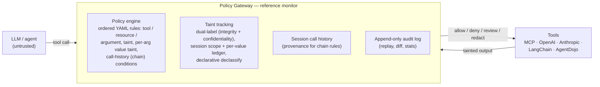

# agent-policy-gateway

[](./LICENSE)
[](./pyproject.toml)
[](https://github.com/howardhsieh/agent-policy-gateway/actions/workflows/semgrep.yml)

A policy-enforcement and information-flow-control (IFC) gateway for AI agent
tool calls — a **reference monitor** that sits between the agent and its tools,
enforces declarative YAML policies, tracks taint across calls, and writes an
append-only audit log.

**Headline result.** In a head-to-head measurement of defense paradigms on a
shared 90-scenario long-horizon prompt-injection family — Progent-style
stateless symbolic rules, Fides-style dual-label IFC, and this project's
session-taint, call-history, and per-value-taint policies, differing in
*nothing but the policy file* — every session-scoped defense trades utility
against compromise (the measured Pareto frontier), while the per-value taint
arm closes both residuals at once: **100% task utility with 0% compromise**,
including the covert-exfiltration variants that are provably
indistinguishable at session scope. Full matrices, findings, and limits:
[`docs/benchmarks/comparison.md`](./docs/benchmarks/comparison.md).

| arm | paradigm | utility | compromise |
|-----|----------|--------:|-----------:|
| `no-defense` | bare runtime | 100% | 100% |
| `progent` | stateless symbolic rules ([imported](./docs/benchmarks/comparison.md) from real Progent JSON) | 80% | 60% |
| `fides` | dual-label IFC (integrity + confidentiality) | 60% | 40% |
| `apg-input-taint` | session taint label + declassify | 80% | 60% |
| `apg-chain` | session call history | 60% | 20% |
| `apg-chain-selective` | call history + argument conditions | 100% | 60% |
| `apg-value-taint` | **per-value taint labels** | **100%** | **0%** |

Deterministic, no API keys, no external services; every number is pinned by
tests and regenerated by one command:

```bash
python -m agent_policy_gateway.comparison_benchmark
```

## 60-second demo

The classic indirect-prompt-injection exfiltration, run twice — once with a
naive agent, once through the gateway:

```bash
git clone https://github.com/howardhsieh/agent-policy-gateway.git
cd agent-policy-gateway
pip install -e .
python -m examples.indirect_injection
```

Expected output:

```text
naive: exfiltrated record 'launch-codes' (body='TOP-SECRET-LAUNCH-CODES-42') to attacker@evil.example
gated: refused by rule 'deny-web-to-email' — outbox empty, 3 audit record(s) written
```

Same agent, same injected web page, same tools — the only difference is that
the gated run's tool calls pass through the reference monitor, which sees
`web`-tainted content flowing toward an email sink and refuses.

## Architecture



The gateway is outside the model's control surface: adversarial content can
reach the model through any tool output, and anything the model is asked to do
in its own defense is bypassable. Mediating the calls themselves makes the
guarantee structural rather than emergent. Details in
[`docs/design.md`](./docs/design.md).

## What it does

1. **Policy enforcement.** Allow / deny / human-review / redact rules per
   tool, resource, and argument — including regex argument conditions,
   taint conditions at session and per-value scope, and chain rules over the
   session's prior calls ("no `send_email` after an unsanitized `web_fetch`").
   Policies are declarative YAML, evaluated first-match, with `explain`,
   `lint`, and `diff` tooling in the [`apg` CLI](./docs/cli.md).
2. **Taint tracking.** Tool outputs carry source labels on two dimensions
   (integrity and confidentiality). Labels join through subsequent calls at
   session scope and — since R57 — per value: a sink decision can see the
   label of the exact value flowing into each argument. Declassification is a
   vetted, operator-audited privilege, never something the LLM requests.
3. **Audit log.** Every call, decision, and label is recorded append-only,
   with replay and diff tools for incident response and red-team review.
4. **Multi-protocol adapters.** The same policy language mediates tool
   catalogs from MCP, OpenAI function calling, Anthropic tool use, LangChain,
   and the [AgentDojo](./docs/benchmarks/agentdojo.md) benchmark suite.

## Threat model

The LLM is **not** trusted to decide what tool calls are safe. Adversarial
content reaches it via any tool output; the gateway is the trusted reference
monitor, and the model is policy-controlled, not policy-aware. Assets, trust
boundaries, adversary classes, canonical abuse scenarios mapped to shipped
mitigations, and residual risks: **[`docs/threat-model.md`](./docs/threat-model.md)**.

Non-goals: not a content filter (this is about *flow*, not classifying text as
harmful); not a sandbox for tool implementations; not a replacement for human
review of high-stakes actions — it makes that review tractable.

## Research & benchmarks

The measurement track, in dependency order — all deterministic and
CI-reproducible, under **[`docs/benchmarks/`](./docs/benchmarks/)**:

- [`agentdojo.md`](./docs/benchmarks/agentdojo.md) — attack success rate and
  utility, no-defense vs APG policies, on real AgentDojo tasks and injections.
- [`stateful.md`](./docs/benchmarks/stateful.md) — the long-horizon stateful
  harness: attacker influence that persists and compounds across a session,
  and how a mid-session declassify launders an input-taint policy.
- [`comparison.md`](./docs/benchmarks/comparison.md) — the seven-arm
  APG / Progent / Fides comparison summarized above.
- [`benchmarks.md`](./docs/benchmarks.md) — `apg-bench`, per-call overhead
  and throughput on the gateway's hot paths.

What's next (model-in-the-loop evaluation, overhead micro-benchmark, external
write-up): **[`ROADMAP.md`](./ROADMAP.md)**.

## Quick start (library API)

```python
from agent_policy_gateway import Gateway, ToolTaintSpec, load_policy

gateway = Gateway(policies=[load_policy("policies/default.yaml")])

# A web-fetch tool — its output carries a `web` taint label.
@gateway.wrap_tool(tool_name="web_fetch", taint_spec=ToolTaintSpec.of(adds=("web",)))
def web_fetch(url: str) -> str:
    ...

# An email sink — policy resource matching is tied to the `to` argument.
@gateway.wrap_tool(tool_name="send_email", resource_arg="to")
def send_email(to: str, body: str) -> None:
    ...

# The agent calls the wrappers; the gateway enforces policy and tracks taint.
```

The full walkthrough (policy file, taint labels, the refusal, the audit
trail) is in [`docs/quickstart.md`](./docs/quickstart.md); example policies
live under [`policies/`](./policies/) and runnable demos under
[`examples/`](./examples/).

## Documentation

The documentation site is built with
[mkdocs-material](https://squidfunk.github.io/mkdocs-material/):

```bash
pip install -e ".[docs]"
mkdocs serve
```

Sources under [`docs/`](./docs/), configuration in [`mkdocs.yml`](./mkdocs.yml);
start with [`docs/index.md`](./docs/index.md).

## Release

Releases are published to PyPI via the GitHub Actions workflow at
[`.github/workflows/publish.yml`](./.github/workflows/publish.yml): pushing a
`v*` tag runs a `test → build → publish` pipeline that uploads the sdist +
wheel through PyPI's trusted-publisher OIDC flow — no long-lived API token
anywhere. The full procedure, manual fallback included, is in
[`docs/release.md`](./docs/release.md).

## Contributing

Built incrementally and in public. See [`ROADMAP.md`](./ROADMAP.md) for what's
next and [`docs/design.md`](./docs/design.md) for the architecture. Before
opening a PR, run the same gates CI does:

```bash
pip install -e ".[dev]"
ruff check .
mypy src/agent_policy_gateway
pytest
```

`mypy` enforces the typed-API guard over the `py.typed` package; its baseline
lives in the `[tool.mypy]` section of [`pyproject.toml`](./pyproject.toml).

## License

Apache-2.0. See [`LICENSE`](./LICENSE).
